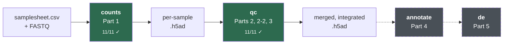

# scrnaseq-pipeline

A single-cell RNA-seq pipeline built step by step against the
[ngs101 tutorial series](https://ngs101.com/tutorials/#single-cell-seq), with the
reasoning written down as it was worked out.

Nextflow DSL2 orchestration over Python and R scripts, in one multi-arch
container. Runs **one stage at a time**, so you can iterate on clustering without
re-running ambient correction.



## Status

| Stage | Tutorial parts | State |
|---|---|---|
| `counts` — FASTQ → count matrices | 1 | **11/11 passing**, cross-quantifier concordance r = 1.0000 |
| `qc` — QC, ambient, doublets, merge, integrate | 2, 2-2, 3 | **11/11 passing**, 32 tasks |
| refusal guards | — | **2/2 passing** |
| `annotate` | 4 | not started |
| `de` | 5 | not started |

Tested against synthetic fixtures with **known ground truth** — planted cell
counts, doublets, contamination fraction and batch effect — so results are
checked by equality rather than by eye.

**Not verified:** Cell Ranger modules and the three index builders need the
licensed x86_64 binary and ~32–64 GB RAM, so they are deferred to cluster
testing. [`docs/COVERAGE.md`](docs/COVERAGE.md) marks nothing done that has not
run, and retires figures when the fixture they were measured on changes.

## Quickstart

```bash
docker pull parsaghadermazi/myrnaseqpipeline:0.2.0

# stage 1 — reads to count matrices
nextflow run main.nf -profile docker \
  --stage counts --input samplesheet.csv --outdir results \
  --quantifier kallisto --genome_fasta genome.fa --gtf genes.gtf

# stage 2 — QC through integration
nextflow run main.nf -profile docker \
  --stage qc --input samplesheet.csv --outdir results
```

Full walkthrough: **[docs/getting-started.md](docs/getting-started.md)**.

## Documentation

**Start here**

| | |
|---|---|
| [getting-started.md](docs/getting-started.md) | requirements, first run, what you get |
| [architecture.md](docs/architecture.md) | diagrams of both stages, the Python/R boundary, the `.h5ad` contract |
| [parameters.md](docs/parameters.md) | every parameter and its default |

**Concepts** — the biology and methods, from first principles

| | |
|---|---|
| [01 — FASTQ to count matrix](docs/lectures/01-fastq-to-counts.md) | barcodes, UMIs, Poisson loading, EmptyDrops, chemistry |
| [02 — QC and cell filtering](docs/lectures/02-qc.md) | ambient RNA, doublets, MAD thresholds, normalisation, HVGs |
| [03 — Integration](docs/lectures/03-integration.md) | batch effects, confounding, anchors, what Harmony actually modifies |

**Reference**

| | |
|---|---|
| [usage.md](docs/usage.md) | detailed per-stage usage |
| [reference.md](docs/reference.md) | references and index building |
| [COVERAGE.md](docs/COVERAGE.md) | every tutorial tool vs what is implemented and verified |
| [testing.md](docs/testing.md) | the fixtures, and what each suite asserts |
| [python-r-bridge.md](docs/python-r-bridge.md) | why no R module writes `.h5ad`, and upstream version traps |
| [design.md](design.md) | design principles and why |

## Testing

```bash
tests/run_tests.sh        /tmp/t1   # stage counts  — 11/11
tests/run_guard_tests.sh  /tmp/t2   # refusals      — 2/2
tests/run_qc_tests.sh     /tmp/t3   # stage qc      — 11/11
```

The guard suite covers the failures that matter most — a design where batch is
perfectly confounded with condition, and a missing raw matrix. Both must be
**refused**: a run that silently removes the treatment effect and emits a
clean-looking object is far more dangerous than a crash.

## Container

Published multi-arch (`linux/amd64` + `linux/arm64`), both resolving to identical
package versions:

```bash
docker pull parsaghadermazi/myrnaseqpipeline:0.2.0
```

Cell Ranger is deliberately absent — 10x's licence forbids redistributing it.
Supply it with `--cellranger_path`.

## Design principles

- **Fail loudly rather than emit quietly-wrong output.** Wrong chemistry, a
  collapsed barcode fraction, a confounded design — all stop the run.
- **Record what was actually used, not what was requested.** Versions are
  captured from running binaries; the conda lock is generated *inside* the image.
- **Raw counts are never overwritten.** `layers["counts"]` survives every stage,
  because DE must never run on corrected values.
- **Interfaces before implementations.** Adding a quantifier is a module plus a
  reader function, not a refactor.

Full rationale: [design.md](design.md).
