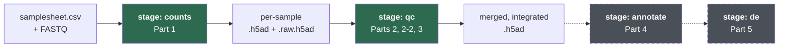
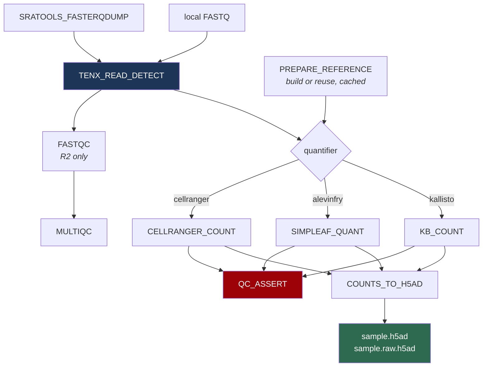
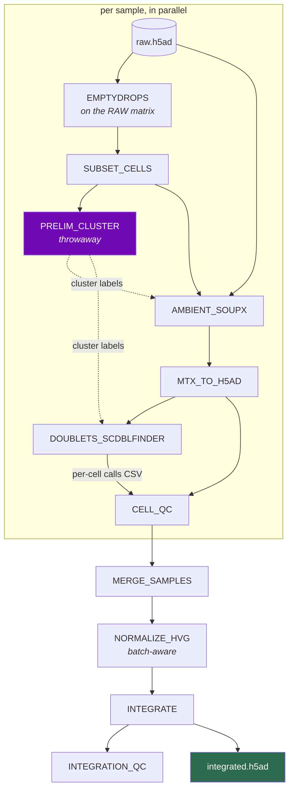
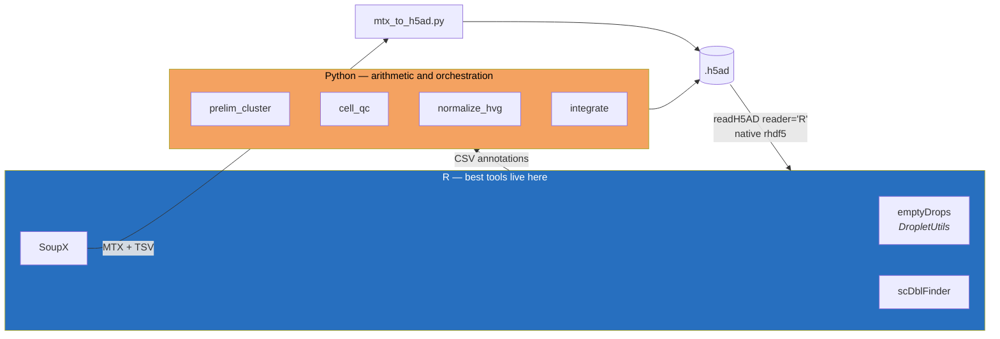

# Architecture

How the pipeline is put together, and why. For *running* it see
[getting-started.md](getting-started.md); for every knob see
[parameters.md](parameters.md).

---

## Stages

The pipeline runs **one stage at a time**. Each is a self-contained invocation
that finds the previous stage's output by convention, so you can iterate on one
step without re-running everything before it.

Solid = built and tested. Dashed = not started.

**Why clustering is not in `qc`:** cluster resolution is the parameter people
iterate on most. If clustering lived at the end of `qc`, changing one number
would re-run ambient correction, doublet detection and integration. It opens
`annotate` instead.

---

## Stage `counts` — FASTQ to count matrices

Two processes are **not** in the tutorial and were added deliberately:

- **`TENX_READ_DETECT`** assigns I1/R1/R2 by *observed read length* rather than
  SRA's arbitrary `_1/_2/_3` numbering, and infers chemistry from R1 length.
  This kills three failure modes at once: the `--include-technical` trap, file
  ordering ambiguity, and silent chemistry mis-declaration.
- **`QC_ASSERT`** fails the run on a collapsed valid-barcode fraction instead of
  passing a garbage matrix downstream.

`COUNTS_TO_H5AD` is the stage boundary: whichever quantifier ran, everything
downstream sees one schema.

---

## Stage `qc` — QC through integration

### The loop

`PRELIM_CLUSTER` exists because the DAG is not actually acyclic in concept:

> SoupX needs cluster labels → clustering needs normalisation → but the *real*
> normalisation belongs **after** ambient correction.

Resolved with a throwaway clustering pass whose labels are used **only** by
SoupX and `scDblFinder`, then discarded. Nothing downstream ever sees them.
Steps `PRELIM_CLUSTER` and `NORMALIZE_HVG` are the same operations run twice, on
different data, for different purposes.

### Why `emptyDrops` and SoupX both read the raw matrix

The empty droplets **are** the ambient measurement. They are not leftovers to
discard — SoupX estimates contamination by comparing what a cluster expresses
against the soup profile taken from barcodes with no cell in them. This is why
stage `counts` emits `.raw.h5ad` and stage `qc` refuses to start without it.

---

## The Python / R boundary

**The bridge is asymmetric, and this was established by testing, not by reading
docs.** R can *read* `.h5ad` natively via `zellkonverter::readH5AD(reader="R")`,
but there is **no native R writer** — `writeH5AD` has no `writer` argument, and
passing one is silently swallowed while the Python path runs, bootstrapping
basilisk and compiling CPython at runtime.

So: **no R module writes `.h5ad`.** R steps emit per-cell annotations as CSV.
The one step that must return a matrix (ambient correction) writes Matrix Market
plus TSVs, and a small Python step converts it. That costs exactly **one**
conversion in the whole DAG.

Full detail: [python-r-bridge.md](python-r-bridge.md).

---

## The `.h5ad` contract

Every stage preserves this. It is what lets `annotate` and `de` be written
without knowing which quantifier or which integration method ran.

| Slot | Contents | Consumed by |
|---|---|---|
| `layers["counts"]` | **raw counts, never modified** | differential expression (Part 5) |
| `X` | log-normalised | marker plots, visualisation |
| `obs` | samplesheet passthrough + QC metrics | grouping, filtering |
| `var` | keyed on **Ensembl gene_id**; symbols in a column | never key on symbols — they are not unique |
| `obsm["X_pca"]` | uncorrected embedding | integration QC baseline |
| `obsm["X_integrated"]` | batch-corrected embedding | neighbours, clustering, UMAP |
| `uns[...]` | JSON strings (h5py cannot store nested dicts) | provenance |

**Integration corrects an embedding, never expression.** Harmony returns
adjusted PCA coordinates; counts and `X` are untouched. This matters because
differential expression must read `layers["counts"]`:

1. integration deliberately removes between-sample variance, which DE needs to
   estimate uncertainty
2. it can remove the condition effect itself, which lives between samples
3. corrected values are not counts, and negative-binomial models assume counts

Nothing downstream ever reads "corrected expression" — it does not exist.

---

## Guards

The pipeline refuses rather than producing plausible-looking wrong output. A
crash is obvious; a silently wrong result reaches a paper.

| Guard | Trigger | Why |
|---|---|---|
| chemistry mismatch | declared chemistry contradicts R1 length | mis-sliced UMIs stop deduplication and inflate counts |
| missing barcode read | no 26/28 bp read present | usually `fasterq-dump` without `--include-technical` |
| low valid barcodes | below `min_valid_barcode_fraction` | signature of wrong chemistry |
| missing `.raw.h5ad` | stage `qc` without the raw matrix | SoupX and emptyDrops cannot measure the soup |
| **confounded design** | `batch_key` is 1:1 with `condition_key` | correcting the batch would delete the treatment effect — an experimental design failure no setting can fix |
| single batch level | only one batch | integration is skipped and logged, not faked |
| no plausible markers | SoupX finds no genes for `autoEstCont` | refuses to guess a contamination fraction |

All are covered by `tests/run_guard_tests.sh`.
